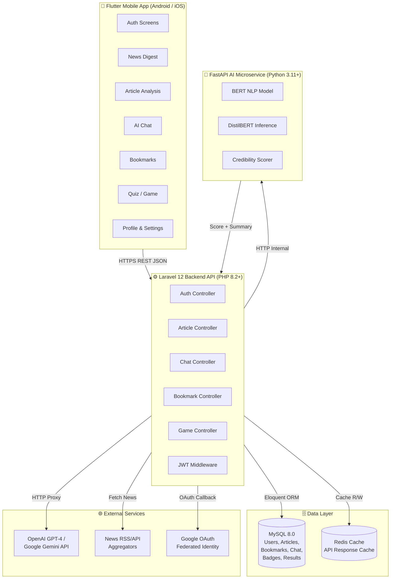
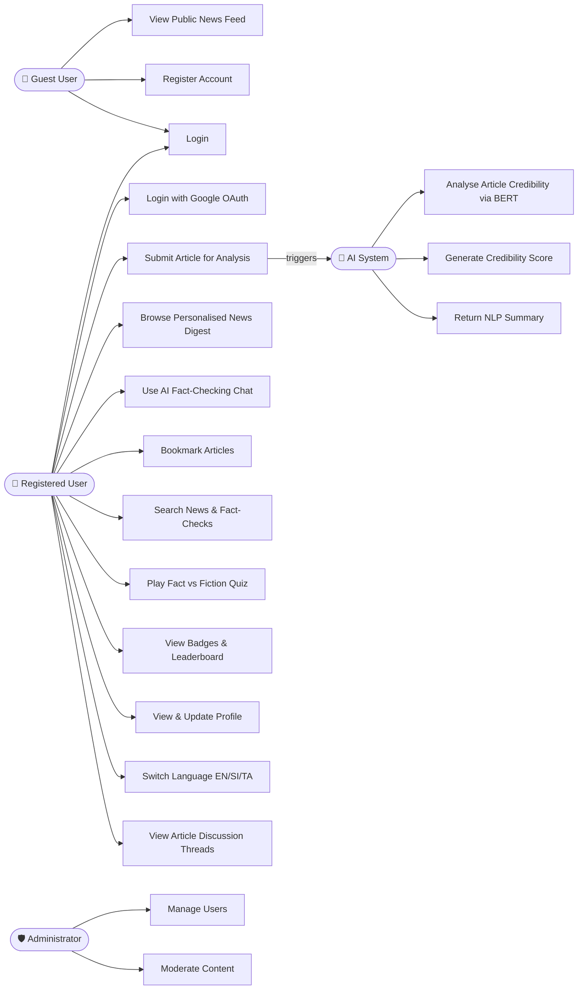
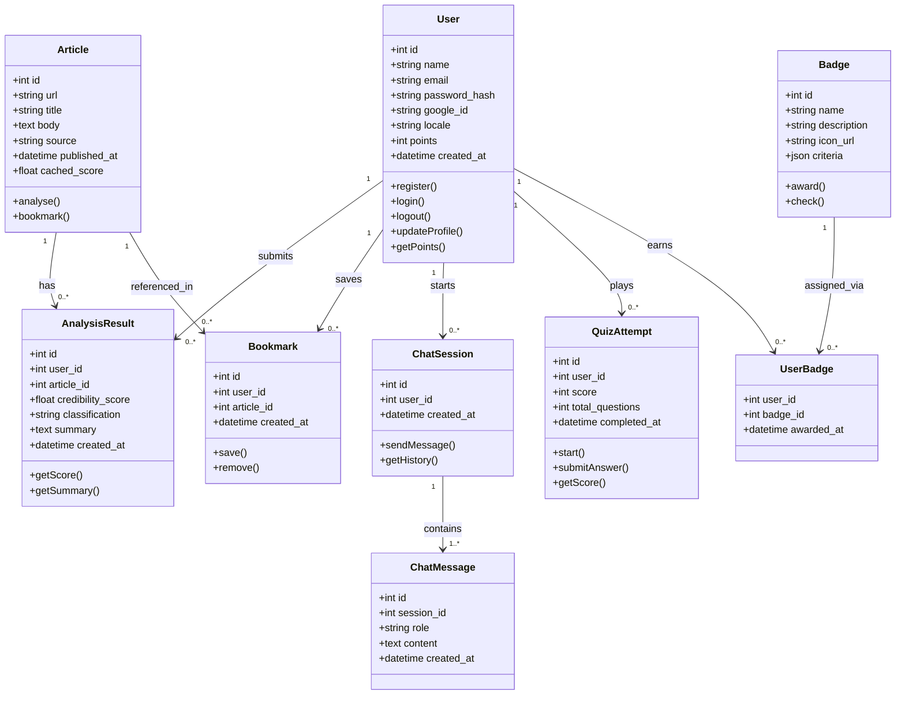
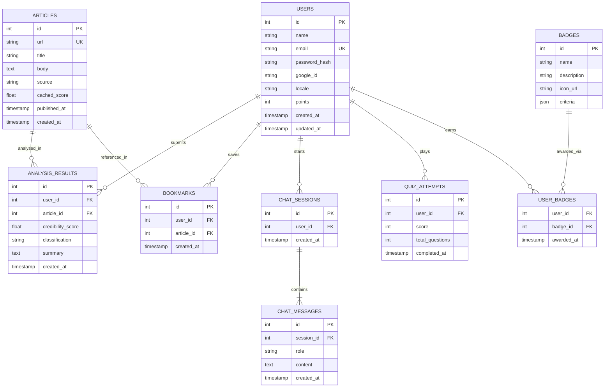
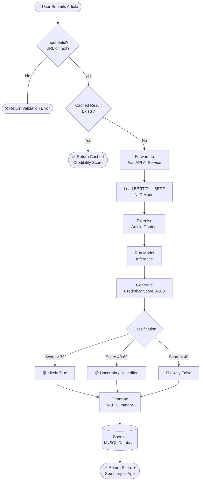
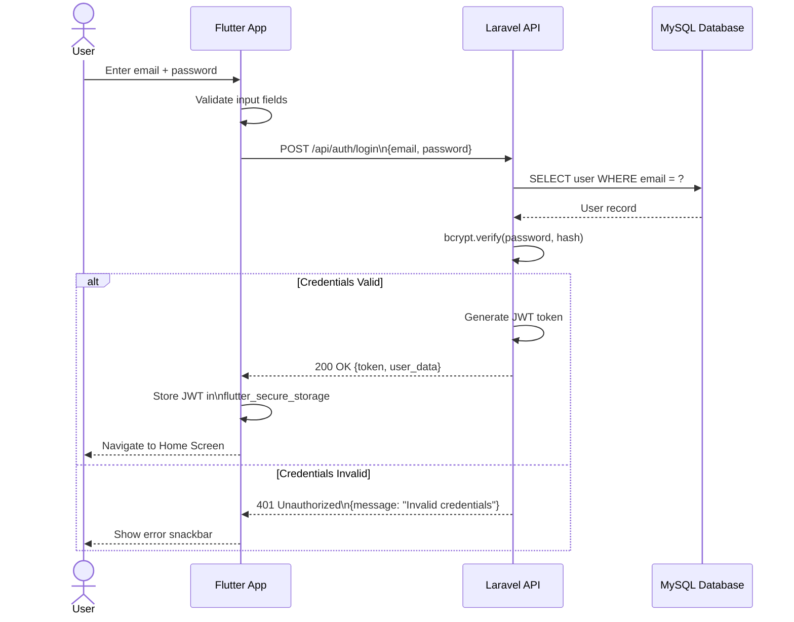
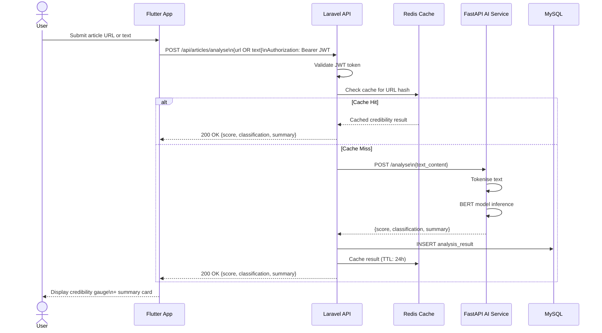
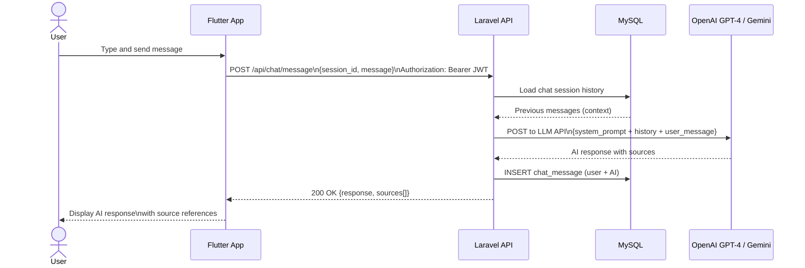
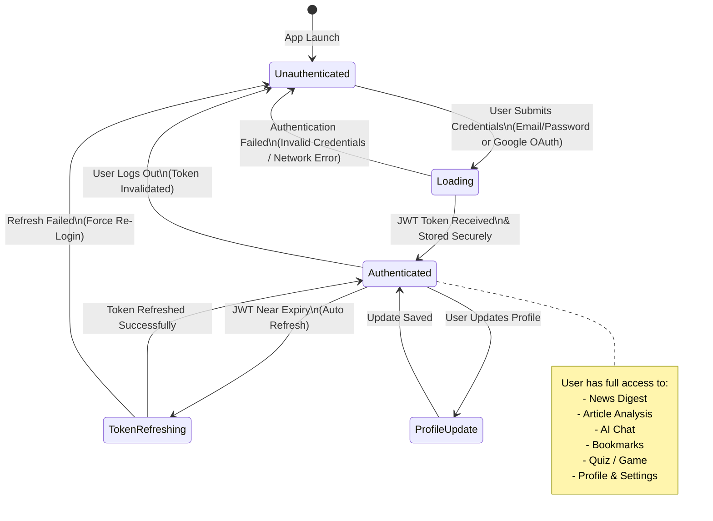
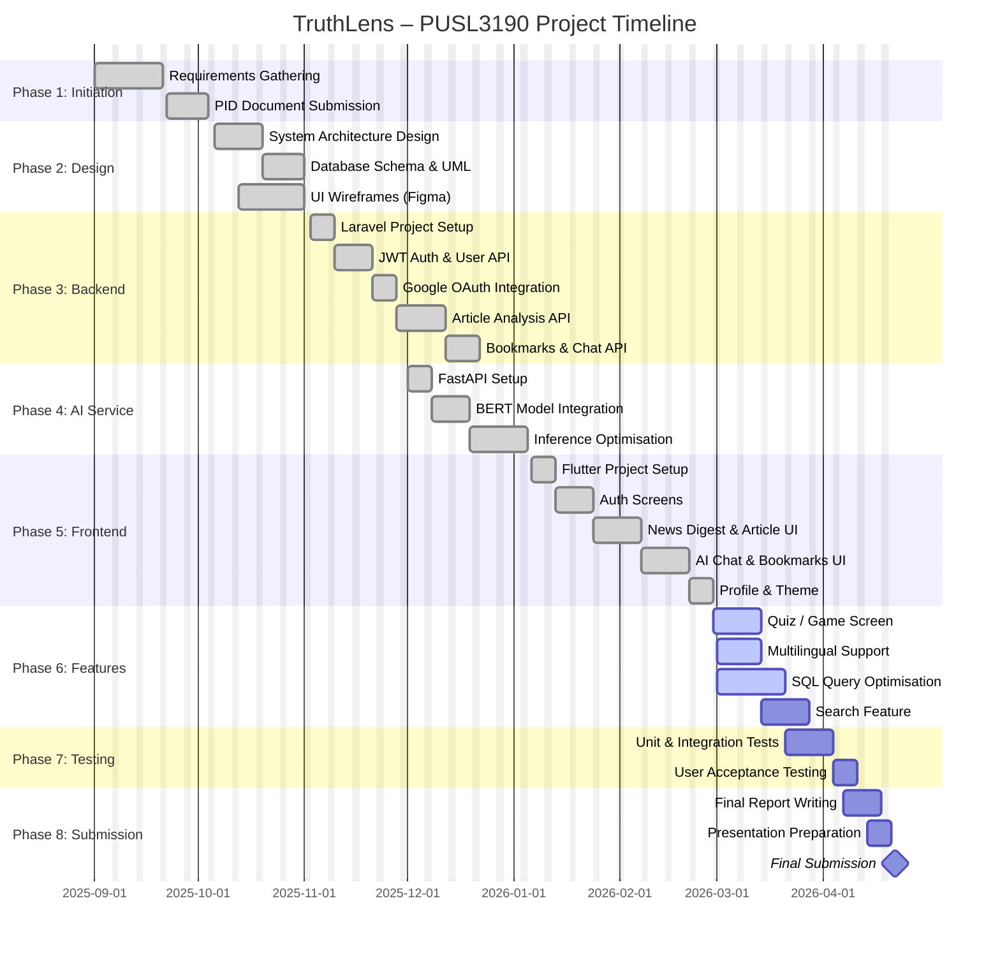

# TruthLens – System Diagrams

> **Project:** TruthLens – AI-Powered Misinformation Detection Platform
> **Student:** Yashira De Silva | **ID:** 10953371
> **Module:** PUSL3190 Computing Project

This file contains all **Mermaid diagram source code** for the TruthLens system.
You can paste any of the code blocks below into a Mermaid-compatible renderer to generate the diagram:

- 🌐 **[Mermaid Live Editor](https://mermaid.live)** – paste code directly to render and export
- ✍️ **VS Code** – install the _Markdown Preview Mermaid Support_ extension
- 📄 **GitHub** – Mermaid is natively rendered in `.md` files

---

## Table of Contents

1. [System Architecture Diagram](#1-system-architecture-diagram)
2. [Use Case Diagram](#2-use-case-diagram)
3. [Class Diagram](#3-class-diagram)
4. [Entity-Relationship (ER) Diagram](#4-entity-relationship-er-diagram)
5. [Activity Diagram – Article Analysis](#5-activity-diagram--article-analysis)
6. [Sequence Diagram – User Login](#6-sequence-diagram--user-login)
7. [Sequence Diagram – Article Credibility Analysis](#7-sequence-diagram--article-credibility-analysis)
8. [Sequence Diagram – AI Chat](#8-sequence-diagram--ai-chat)
9. [State Diagram – Authentication State](#9-state-diagram--authentication-state)
10. [Project Timeline (Gantt Chart)](#10-project-timeline-gantt-chart)

---

## 1. System Architecture Diagram

This diagram illustrates the high-level multi-tier architecture of TruthLens.



---

## 2. Use Case Diagram

This diagram shows all system actors and use cases.



---

## 3. Class Diagram

This diagram shows the core domain classes and their relationships.



---

## 4. Entity-Relationship (ER) Diagram

This diagram shows the relational database schema.



---

## 5. Activity Diagram – Article Analysis

This diagram shows the flow when a user submits an article for credibility analysis.



---

## 6. Sequence Diagram – User Login

This diagram shows the authentication flow for email/password login.



---

## 7. Sequence Diagram – Article Credibility Analysis

This diagram shows the full pipeline from article submission to result display.



---

## 8. Sequence Diagram – AI Chat

This diagram shows the flow of a user message through the AI chat feature.



---

## 9. State Diagram – Authentication State

This diagram shows all authentication states in the Flutter application.



---

## 10. Project Timeline (Gantt Chart)

This diagram shows the full project timeline from initiation to final submission.



---

## How to Render These Diagrams

### Option 1: Mermaid Live Editor (Recommended)

1. Go to **[mermaid.live](https://mermaid.live)**
2. Paste the code block content (without the triple backticks)
3. Click **"Export"** to download as SVG or PNG

### Option 2: VS Code

1. Install extension: **"Markdown Preview Mermaid Support"** (by Matt Bierner)
2. Open this `.md` file
3. Press `Cmd+Shift+V` (Mac) to open Markdown Preview
4. Diagrams render inline automatically

### Option 3: GitHub

- Mermaid diagrams in `.md` files are **rendered natively** on GitHub
- Simply push this file to your repository and view it on GitHub.com

### Option 4: Pandoc + PDF Export

```bash
# Install mermaid CLI
npm install -g @mermaid-js/mermaid-cli

# Export individual diagram from a file
mmdc -i diagram.mmd -o diagram.png

# Generate PDF from markdown with mermaid
pandoc DIAGRAMS_README.md -o diagrams.pdf
```

---

_© 2026 – Student ID: 10953371 – Yashira De Silva – PUSL3190 Computing Project_
